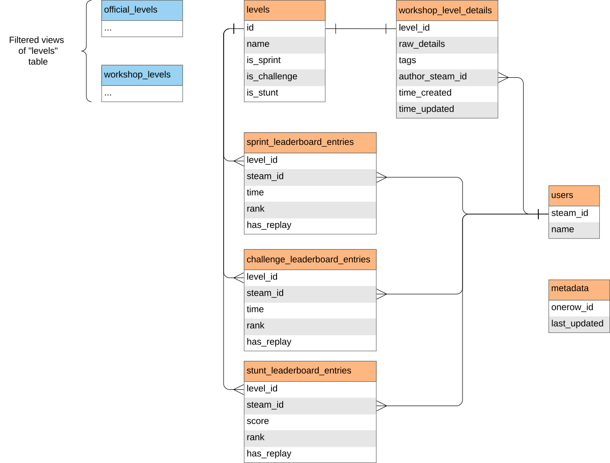

# Distance DB guide

The Distance database contains data on all sprint, challenge, and stunt maps in Distance. You can perform queries to the database at [this link](https://distance-db-sql.seekr.pw/). Queries are written in the SQL language, specifically the dialect used by PostgreSQL. If you don't know SQL, or need a refresher, I found [sqltutorial.org](https://www.sqltutorial.org/) helpful. Here is a view of the database schema:



The `workshop_level_details` table contains a `raw_details` column which holds a large amount of metadata of each workshop level in JSON format. All other `workshop_level_details` columns are generated from this data. Below is a sample of this JSON data:

<details>
<summary>`raw_details` sample</summary>

```json
{
  "result": 1,
  "publishedfileid": "3274152841",
  "creator": "76561198314429818",
  "creator_appid": 233610,
  "consumer_appid": 233610,
  "consumer_shortcutid": 0,
  "filename": "cl06 end to a violent heart.bytes",
  "file_size": "772518",
  "preview_file_size": "438069",
  "file_url": "https://steamusercontent-a.akamaihd.net/ugc/2455105898804613920/FF93C0C046CE59648198DD647C993ABF5E793B8D/",
  "preview_url": "https://steamuserimages-a.akamaihd.net/ugc/2455105898804614047/9276AC84466FA91F42A6A1104F3905EA6E49F977/",
  "url": "",
  "hcontent_file": "2455105898804613920",
  "hcontent_preview": "2455105898804614047",
  "title": "CL06 End To A Violent Heart",
  "file_description": "You're inside the tower. Flight through the guardian, avoid all obstacles and reach to the Core to end this mess!",
  "time_created": 1719183533,
  "time_updated": 1719183533,
  "visibility": 0,
  "flags": 1536,
  "workshop_file": false,
  "workshop_accepted": false,
  "show_subscribe_all": false,
  "num_comments_public": 0,
  "banned": false,
  "ban_reason": "",
  "banner": "76561197960265728",
  "can_be_deleted": true,
  "app_name": "Distance",
  "file_type": 0,
  "can_subscribe": true,
  "subscriptions": 3,
  "favorited": 0,
  "followers": 0,
  "lifetime_subscriptions": 3,
  "lifetime_favorited": 0,
  "lifetime_followers": 0,
  "lifetime_playtime": "74",
  "lifetime_playtime_sessions": "1",
  "views": 1,
  "num_children": 0,
  "num_reports": 0,
  "tags": [
    {
      "tag": "level",
      "display_name": "level"
    },
    {
      "tag": "Sprint",
      "display_name": "Sprint"
    },
    {
      "tag": "Advanced",
      "display_name": "Advanced"
    }
  ],
  "vote_data": {
    "score": 0,
    "votes_up": 0,
    "votes_down": 0
  },
  "language": 0,
  "maybe_inappropriate_sex": false,
  "maybe_inappropriate_violence": false,
  "revision_change_number": "5",
  "revision": 1,
  "ban_text_check_result": 5
}
```

</details>

## Example queries

```sql
-- Authors with most levels published
SELECT name,
       COUNT(*) levels_published
FROM users
         JOIN workshop_level_details wld on users.steam_id = wld.author_steam_id
GROUP BY steam_id
ORDER BY levels_published DESC
LIMIT 100
```

[Link](<https://distance-db-sql.seekr.pw/?query=--%20Authors%20with%20most%20levels%20published%0ASELECT%20name%2C%0A%20%20%20%20%20%20%20COUNT(*)%20levels_published%0AFROM%20users%0A%20%20%20%20%20%20%20%20%20JOIN%20workshop_level_details%20wld%20on%20users.steam_id%20%3D%20wld.author_steam_id%0AGROUP%20BY%20steam_id%0AORDER%20BY%20levels_published%20DESC%0ALIMIT%20100>)

---

```sql
-- Authors with highest average level score
SELECT name,
       AVG(score) avg_score,
       COUNT(*)   levels_published
FROM users
         JOIN workshop_level_details wld on users.steam_id = wld.author_steam_id
GROUP BY steam_id
ORDER BY avg_score DESC
LIMIT 100
```

[Link](<https://distance-db-sql.seekr.pw/?query=--%20Authors%20with%20highest%20average%20level%20score%0ASELECT%20name%2C%0A%20%20%20%20%20%20%20AVG(score)%20avg_score%2C%0A%20%20%20%20%20%20%20COUNT(*)%20%20%20levels_published%0AFROM%20users%0A%20%20%20%20%20%20%20%20%20JOIN%20workshop_level_details%20wld%20on%20users.steam_id%20%3D%20wld.author_steam_id%0AGROUP%20BY%20steam_id%0AORDER%20BY%20avg_score%20DESC%0ALIMIT%20100>)

---

```sql
-- Maps ordered by score
SELECT name,
       score
FROM levels
         JOIN workshop_level_details wld on levels.id = wld.level_id
ORDER BY score DESC
LIMIT 100
```

[Link](https://distance-db-sql.seekr.pw/?query=--%20Maps%20ordered%20by%20score%0ASELECT%20name%2C%0A%20%20%20%20%20%20%20score%0AFROM%20levels%0A%20%20%20%20%20%20%20%20%20JOIN%20workshop_level_details%20wld%20on%20levels.id%20%3D%20wld.level_id%0AORDER%20BY%20score%20DESC%0ALIMIT%20100)

---

```sql
-- Maps ordered by upvotes - downvotes
SELECT name,
       votes_up - votes_down "upvotes - downvotes"
FROM levels
         JOIN workshop_level_details wld on levels.id = wld.level_id
ORDER BY "upvotes - downvotes" DESC
LIMIT 100
```

[Link](https://distance-db-sql.seekr.pw/?query=--%20Maps%20ordered%20by%20upvotes%20-%20downvotes%0ASELECT%20name%2C%0A%20%20%20%20%20%20%20votes_up%20-%20votes_down%20%22upvotes%20-%20downvotes%22%0AFROM%20levels%0A%20%20%20%20%20%20%20%20%20JOIN%20workshop_level_details%20wld%20on%20levels.id%20%3D%20wld.level_id%0AORDER%20BY%20%22upvotes%20-%20downvotes%22%20DESC%0ALIMIT%20100)

---

```sql
-- Maps with the default description "An awesome community level"
SELECT name
FROM levels
         JOIN workshop_level_details wld on levels.id = wld.level_id
WHERE description = 'An awesome community level'
```

[Link](https://distance-db-sql.seekr.pw/?query=--%20Maps%20with%20the%20default%20description%20%22An%20awesome%20community%20level%22%0ASELECT%20name%0AFROM%20levels%0A%20%20%20%20%20%20%20%20%20JOIN%20workshop_level_details%20wld%20on%20levels.id%20%3D%20wld.level_id%0AWHERE%20description%20%3D%20%27An%20awesome%20community%20level%27)

---

```sql
-- Players with most amount of 1st places in Sprint levels
SELECT name, COUNT(*) firsts
FROM users
         JOIN sprint_leaderboard_entries sle on users.steam_id = sle.steam_id
WHERE rank = 1
GROUP BY name
ORDER BY firsts DESC
LIMIT 100
```

[Link](<https://distance-db-sql.seekr.pw/?query=--%20Players%20with%20most%20amount%20of%201st%20places%20in%20Sprint%20levels%0ASELECT%20name%2C%20COUNT(*)%20firsts%0AFROM%20users%0A%20%20%20%20%20%20%20%20%20JOIN%20sprint_leaderboard_entries%20sle%20on%20users.steam_id%20%3D%20sle.steam_id%0AWHERE%20rank%20%3D%201%0AGROUP%20BY%20name%0AORDER%20BY%20firsts%20DESC%0ALIMIT%20100>)

---

```sql
-- Sprint levels with only one time on the leaderboards
SELECT levels.name "level", u.name "player"
FROM levels
         JOIN sprint_leaderboard_entries sle on levels.id = sle.level_id
         JOIN users u on sle.steam_id = u.steam_id
WHERE level_id IN (SELECT level_id
                   FROM sprint_leaderboard_entries
                   GROUP BY level_id
                   HAVING COUNT(*) = 1)
```

[Link](<https://distance-db-sql.seekr.pw/?query=--%20Sprint%20levels%20with%20only%20one%20time%20on%20the%20leaderboards%0ASELECT%20levels.name%20%22level%22%2C%20u.name%20%22player%22%0AFROM%20levels%0A%20%20%20%20%20%20%20%20%20JOIN%20sprint_leaderboard_entries%20sle%20on%20levels.id%20%3D%20sle.level_id%0A%20%20%20%20%20%20%20%20%20JOIN%20users%20u%20on%20sle.steam_id%20%3D%20u.steam_id%0AWHERE%20level_id%20IN%20(SELECT%20level_id%0A%20%20%20%20%20%20%20%20%20%20%20%20%20%20%20%20%20%20%20FROM%20sprint_leaderboard_entries%0A%20%20%20%20%20%20%20%20%20%20%20%20%20%20%20%20%20%20%20GROUP%20BY%20level_id%0A%20%20%20%20%20%20%20%20%20%20%20%20%20%20%20%20%20%20%20HAVING%20COUNT(*)%20%3D%201)>)

---

```sql
-- Players with most sprint leaderboard times, and what percent of all levels they've set a time on
SELECT name,
       t1.sprint_entries,
       t1.sprint_entries::real / (SELECT COUNT(*) FROM levels WHERE is_sprint)::real percent
FROM users
         JOIN (SELECT users.steam_id, COUNT(*) sprint_entries
               FROM users
                        JOIN sprint_leaderboard_entries sle on users.steam_id = sle.steam_id
               GROUP BY users.steam_id) t1 ON users.steam_id = t1.steam_id
ORDER BY t1.sprint_entries DESC
LIMIT 100
```

[Link](<https://distance-db-sql.seekr.pw/?query=--%20Players%20with%20most%20sprint%20leaderboard%20times%2C%20and%20what%20percent%20of%20all%20levels%20they%27ve%20set%20a%20time%20on%0ASELECT%20name%2C%0A%20%20%20%20%20%20%20t1.sprint_entries%2C%0A%20%20%20%20%20%20%20t1.sprint_entries%3A%3Areal%20%2F%20(SELECT%20COUNT(*)%20FROM%20levels%20WHERE%20is_sprint)%3A%3Areal%20percent%0AFROM%20users%0A%20%20%20%20%20%20%20%20%20JOIN%20(SELECT%20users.steam_id%2C%20COUNT(*)%20sprint_entries%0A%20%20%20%20%20%20%20%20%20%20%20%20%20%20%20FROM%20users%0A%20%20%20%20%20%20%20%20%20%20%20%20%20%20%20%20%20%20%20%20%20%20%20%20JOIN%20sprint_leaderboard_entries%20sle%20on%20users.steam_id%20%3D%20sle.steam_id%0A%20%20%20%20%20%20%20%20%20%20%20%20%20%20%20GROUP%20BY%20users.steam_id)%20t1%20ON%20users.steam_id%20%3D%20t1.steam_id%0AORDER%20BY%20t1.sprint_entries%20DESC%0ALIMIT%20100>)

---

```sql
-- Longest Sprint leaderboard times
SELECT levels.name "Level", u.name "Player", time
FROM levels
         JOIN sprint_leaderboard_entries sle on levels.id = sle.level_id
         JOIN users u on sle.steam_id = u.steam_id
ORDER BY time DESC
LIMIT 100
```

[Link](https://distance-db-sql.seekr.pw/?query=--%20Longest%20Sprint%20leaderboard%20times%0ASELECT%20levels.name%20%22Level%22%2C%20u.name%20%22Player%22%2C%20time%0AFROM%20levels%0A%20%20%20%20%20%20%20%20%20JOIN%20sprint_leaderboard_entries%20sle%20on%20levels.id%20%3D%20sle.level_id%0A%20%20%20%20%20%20%20%20%20JOIN%20users%20u%20on%20sle.steam_id%20%3D%20u.steam_id%0AORDER%20BY%20time%20DESC%0ALIMIT%20100)

---

```sql
-- The ranking on all official sprint levels of a particular player, starting from worst
SELECT name, rank
FROM (SELECT *
      FROM levels
      WHERE is_sprint
        AND id NOT IN (SELECT level_id FROM workshop_level_details)) official_sprint
         LEFT JOIN (SELECT * FROM sprint_leaderboard_entries WHERE steam_id = 76561198032726698) sle
                   on sle.level_id = official_sprint.id
ORDER BY rank DESC
```

[Link](<https://distance-db-sql.seekr.pw/?query=--%20The%20ranking%20on%20all%20official%20sprint%20levels%20of%20a%20particular%20player%2C%20starting%20from%20worst%0ASELECT%20name%2C%20rank%0AFROM%20(SELECT%20*%0A%20%20%20%20%20%20FROM%20levels%0A%20%20%20%20%20%20WHERE%20is_sprint%0A%20%20%20%20%20%20%20%20AND%20id%20NOT%20IN%20(SELECT%20level_id%20FROM%20workshop_level_details))%20official_sprint%0A%20%20%20%20%20%20%20%20%20LEFT%20JOIN%20(SELECT%20*%20FROM%20sprint_leaderboard_entries%20WHERE%20steam_id%20%3D%2076561198032726698)%20sle%0A%20%20%20%20%20%20%20%20%20%20%20%20%20%20%20%20%20%20%20on%20sle.level_id%20%3D%20official_sprint.id%0AORDER%20BY%20rank%20DESC>)

---

```sql
-- Oldest maps on the workshop
SELECT name, time_created, is_sprint, is_challenge, is_stunt
FROM levels
         JOIN workshop_level_details wld on levels.id = wld.level_id
ORDER BY time_created
LIMIT 100
```

[Link](https://distance-db-sql.seekr.pw/?query=--%20Oldest%20maps%20on%20the%20workshop%0ASELECT%20name%2C%20time_created%2C%20is_sprint%2C%20is_challenge%2C%20is_stunt%0AFROM%20levels%0A%20%20%20%20%20%20%20%20%20JOIN%20workshop_level_details%20wld%20on%20levels.id%20%3D%20wld.level_id%0AORDER%20BY%20time_created%0ALIMIT%20100)

---

```sql
-- Least-recently updated maps on the workshop
SELECT name, time_updated, is_sprint, is_challenge, is_stunt
FROM levels
         JOIN workshop_level_details wld on levels.id = wld.level_id
ORDER BY time_updated
LIMIT 100
```

[Link](https://distance-db-sql.seekr.pw/?query=--%20Least-recently%20updated%20maps%20on%20the%20workshop%0ASELECT%20name%2C%20time_updated%2C%20is_sprint%2C%20is_challenge%2C%20is_stunt%0AFROM%20levels%0A%20%20%20%20%20%20%20%20%20JOIN%20workshop_level_details%20wld%20on%20levels.id%20%3D%20wld.level_id%0AORDER%20BY%20time_updated%0ALIMIT%20100)

---
